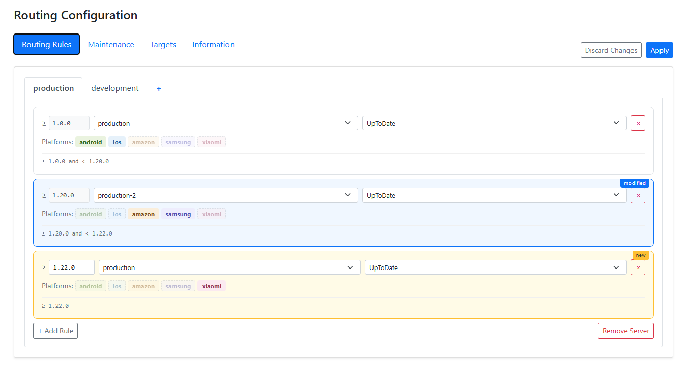
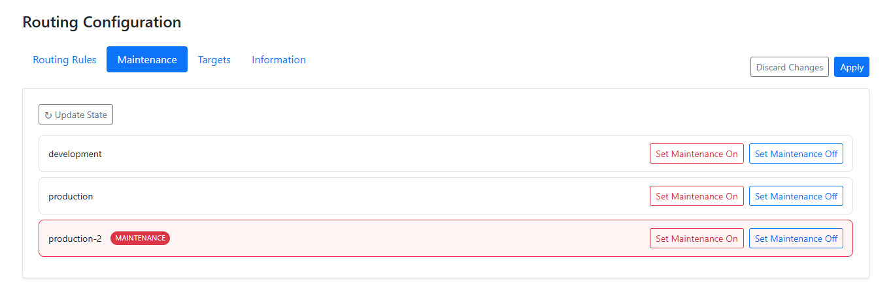
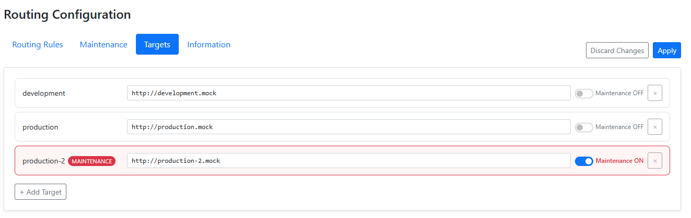

# Router

A routing service that directs clients to the correct backend server. The main job of the router is to answer the client's `GetServerAddress` request: the client sends its identity (`Server`, `Platform`, `ClientVersion`), receives the address of the backend it should talk to, and from then on works directly with that backend.

## How it works

Routing is driven by two pieces of configuration:

- **Targets** — named backend servers, each with a `Target` name, an `Address`, and a `Maintenance` flag.
- **Routing rules** — map a `(Server, Platform, ClientVersion)` triple to one of the targets and carry an `UpdateMode`.

When a client calls `POST Prod/get-server-address`, the router looks up the matching rule, resolves the target it points to, and returns the target's address together with one of the `UpdateMode` values:

- `UpToDate` — client is current, address returned.
- `UpdateRecommended` — newer version available, address still returned.
- `UpdateRequiredOfflineAllowed` — update required, offline use allowed.
- `UpdateRequired` — update required, no address returned.

If the resolved target has its `Maintenance` flag set, the router responds with the `Maintenance` status instead of an address.

## Managing targets and rules

Targets and routing rules are managed through the REST API exposed by the router. The full request/response reference (with status codes, validation rules, and curl examples) lives in [API.md](API.md). The same operations are also available through the admin UI for users who prefer not to call the API directly.

The public `get-server-address` endpoint is open. All management endpoints require an `Authorization: <token>` header configured on the server side.

📸 Click to view Admin UI Screenshots

### Routing Rules Configuration

### Maintenance

### Targets Management

## Reserved `maintenance` target

The router reserves a target named `maintenance` for switching traffic during downtime. On every startup the router checks whether this target exists in the configuration and creates it automatically if it is missing (with `Maintenance = true` and a placeholder address). This guarantees that there is always a target available to redirect routing rules to when a real backend needs to go offline.

## Tech stack

- C# / .NET — REST API server (.NET 7) and Blazor Server admin UI (.NET 8).
- DynamoDB as the production storage backend, with a Redis cache layer in front of it; a mock in-memory backend is available for local development.
- An AWS Lambda variant of the same routing logic is also provided for serverless deployments.
